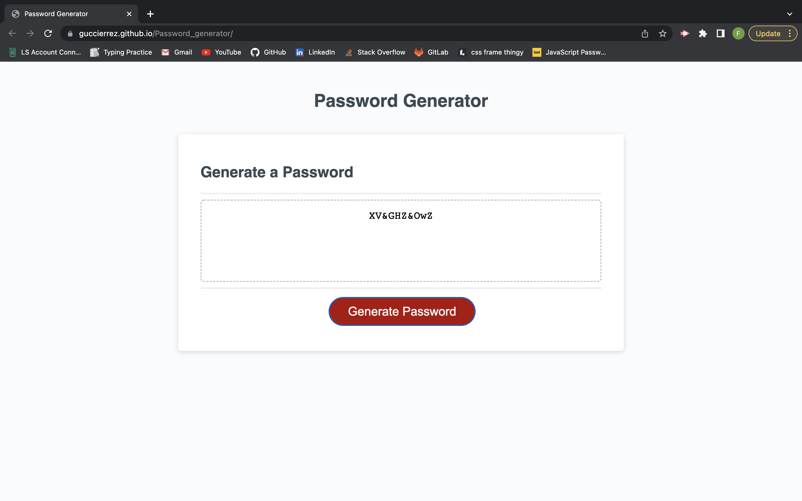

<!-- PROJECT LOGO -->
 

  

  <h3 align="center">The Worlds (my) Bestest Password Generator</h3>

  

    A  password generator for all your needs.
     

<!-- ABOUT THE PROJECT -->
## About The Project

This is my first project that I've built with javasctript. A password generator that can be modified to suit the users needs.

(<a href="#readme-top">back to top</a>)

### Built With

This page was built with HTML, CSS and Javasript.

### Prerequisites

No prerequisites required.

### Installation

This page requires no installation of any kind simply click on the link, hit generate, pick your requierments, and copy results.

(<a href="#readme-top">back to top</a>)

<!-- USAGE EXAMPLES -->
## Usage
This page is amazing for creating unique and one-of-a-kind passwords that you can customize with, lowercase and uppercase letters, numbers and even unique characters.

(<a href="#readme-top">back to top</a>)

<!-- CONTRIBUTING -->
## Contributing

I am the only direct(instructors and tutor helped) contributer to this Repo.

(<a href="#readme-top">back to top</a>)

<!-- LICENSE -->
## License

Still no licenses unfortunately

(<a href="#readme-top">back to top</a>)

<!-- CONTACT -->
## Contact

Fabian Gutierrez - [fabiangutierrez580@gmail.com]
(LinkedIn) - [www.linkedin.com/in/fabian-gutierrez-016523248]

Project Link: [https://github.com/Guccierrez/Password_generator]

<!-- ACKNOWLEDGMENTS -->
## Acknowledgments
Again shout out to My instructors, Mr. Edwards and Mr. Andrew. This week I'd also like to thank my tutor Mr. Brandon Leek

<!-- MARKDOWN LINKS & IMAGES -->
